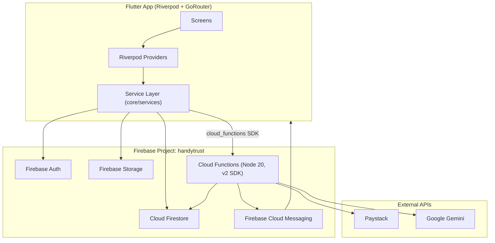

# HandyTrust

A Flutter + Firebase services marketplace connecting customers in Nigeria with vetted, identity-verified artisans (plumbers, electricians, carpenters, and similar trades) — covering job posting, quoting, in-app chat, escrow payments, dispute resolution, and a full admin back office.

## Problem Statement

Finding a reliable, identity-verified artisan in Nigeria's informal services market is hard: there's no shared trust signal across providers, payment is typically cash-on-delivery with no recourse if work is incomplete or substandard, and customers have no structured way to compare quotes or resolve disputes.

## Solution

HandyTrust gives every artisan an identity-verification record and a computed trust score, routes payment through an escrow step (held until the customer confirms completion, or auto-released if they don't respond), and gives admins a single dashboard to approve artisans, review verification submissions, and resolve disputes — so trust is established by the platform, not by chance.

## Key Features

### Customer Features
- Post a job request with photos, budget range, urgency, and optional scheduled date
- Optional AI-assisted description enhancement (Gemini) before posting — suggests a category and a tightened description; the customer explicitly accepts or ignores it
- Browse responding artisans, review quotes, accept one
- In-app chat per job (text, image, price-negotiation, and system messages)
- Pay into escrow via Paystack (card/bank/USSD/transfer)
- Confirm job completion, leave a star rating + review
- Raise a dispute on an active or recently-completed job
- Submit support tickets and track their status

### Artisan Features
- Two-step registration (account → professional profile), reviewed by an admin before going public
- Identity verification: selfie + government ID upload, with a **"Verify Later"** deferral option that skips the upload requirement without blocking onboarding
- Browse the open jobs feed for their category (visible to any registered artisan, regardless of approval/verification status) and submit quotes (quoting itself requires admin-approved + identity-verified status)
- Toggle availability for new jobs
- Manage a portfolio of work photos
- Manage bank/payout details
- Computed trust score with a visible weighted breakdown (rating, completed jobs, verification, response time, dispute history)

### Admin Features
Eight tabs in one dashboard:
- **Pending Approval** — review and approve/reject new artisan applications
- **All Artisans** — searchable/filterable directory with trust score, rating, and verification status visible per artisan
- **Verification Center** — review pending selfie/ID submissions, approve or reject with a reason
- **Disputes** — review and resolve open disputes
- **Users** — searchable/filterable list of all accounts; suspend/reactivate; **delete a user** (removes their Firestore profile and, best-effort, disables their Firebase Auth account)
- **Support** — view and resolve support tickets
- **Reviews** — view reviews; delete one (recomputes the artisan's rating aggregate)
- **Jobs** — every job in the system with status, customer, and an explicit **"Accepted by: {artisan}"** / **"Not accepted yet"** indicator; delete a job (for spam/fake requests), which also clears its chat thread

### Platform Features
- Role-based accounts (a single account can hold `customer` and/or `artisan` roles, plus a separate `admin` grant)
- Light/dark theme, toggled and persisted locally
- Push notifications (FCM) plus in-app notification feed, triggered server-side on job status changes
- Audit log on every job mutation (who, what, when, why) — immutable, admin-readable

## System Architecture



- **Flutter frontend** — single codebase targeting Android, iOS, Web, Windows, macOS, and Linux (all six platform folders exist in the repo).
- **Riverpod** — all state (auth, job streams, providers per feature) flows through `StreamProvider`/`StateNotifierProvider`; no other state management library is used.
- **GoRouter** — declarative routing with an auth-aware redirect (`AuthChangeNotifier`) that re-evaluates on auth state and profile changes (e.g. an admin suspending an account mid-session).
- **Firebase Authentication** — email/password and phone sign-in; anonymous sign-in is explicitly excluded from every privileged Firestore/Storage rule.
- **Cloud Firestore** — the primary database (see [Firestore Collections](#firestore-collections)).
- **Firebase Storage** — job photos, profile photos, verification documents, portfolio photos, dispute evidence.
- **Cloud Functions (2nd gen)** — webhook handling, scheduled escrow release, Firestore-triggered side effects (stats, trust score, push notifications), and two callables (AI job analysis, admin user deletion).

A single service layer (`lib/core/services`) is the only thing that writes to Firestore/Storage from the client — `JobService` in particular enforces a strict state machine and writes an audit log entry atomically with every job mutation; no screen writes to `/jobs` directly.

## Application Flow

```
Customer posts job (status: requested)
        │
        ▼
Artisan browses Open Jobs Feed → submits quote
        │
        ▼
Customer accepts a quote (status: matched) → assigned artisan set
        │
        ▼
In-app chat opens (status: inChat) → price can be (re)negotiated
        │
        ▼
Customer pays (status: paymentPending → escrowLocked via Paystack webhook)
        │
        ▼
Artisan starts work (status: inProgress) → submits completion photos (status: submitted)
        │
        ▼
Customer confirms (status: completed, escrow released)
   — or auto-released after the configured window if the customer never responds —
        │
        ▼
Customer leaves a review · either party may instead raise a dispute at almost any stage from escrowLocked onward
```

## Firestore Collections

Verified directly from `firestore.rules`. Only collections that actually exist are listed — there is **no top-level `chats` collection**; chat messages live in a `messages` subcollection under each job (see below).

| Collection | Purpose |
|---|---|
| `users/{uid}` | Account profile, roles, account status |
| `artisans/{uid}` | Public artisan profile, approval/verification status, trust score |
| `artisan_private/{uid}` | Bank details, private ID data (owner/admin only) |
| `jobs/{jobId}` | The job lifecycle document |
| `jobs/{jobId}/auditLogs/{logId}` | Immutable, server-written audit trail per job |
| `jobs/{jobId}/messages/{msgId}` | **Chat lives here** — per-job, not a top-level collection |
| `jobs/{jobId}/quotes/{quoteId}` | Artisan quotes; document ID == artisan ID |
| `payments/{paymentId}` | Payment/escrow records |
| `reviews/{reviewId}` | Customer reviews on completed jobs |
| `disputes/{disputeId}` | Dispute records |
| `verifications/{uid}` | Selfie/ID submissions for admin review (also used for the "Verify Later" placeholder status) |
| `portfolio_analytics/{artisanId}` | View-count analytics for artisan portfolios |
| `fcm_tokens/{uid}` | Push notification tokens (unreadable by clients, written by the owner) |
| `escrow_releases/{id}` | Escrow release queue processed by a Cloud Function |
| `admins/{uid}` | Admin registry — existence of a doc here grants Firestore-level admin |
| `config/{doc}` | App-wide config (Paystack key, feature flags) — see [Security Model](#security-model) for a caveat |
| `support_tickets/{ticketId}` | Support requests |
| `notifications/{notifId}` | In-app notification feed |

## Security Model

- **Authentication**: Firebase Auth (email/password, phone). Every privileged rule explicitly excludes anonymous sign-in.
- **Authorization**: per-document Firestore rules keyed on `request.auth.uid` against `customerId`/`artisanId`/`raisedBy`/etc. Artisans can read the open-jobs feed once they have *any* artisan profile (regardless of approval state); actually quoting on a job or being matched into one requires `approvalStatus == 'approved'` **and** `verificationStatus in ['id_verified', 'trusted']`.
- **Admin access** is checked in **two different ways depending on which product is being called**, and these are not automatically kept in sync:
  - Firestore rules' `isAdmin()` checks for the existence of a document at `/admins/{uid}`.
  - Storage rules' `isAdmin()` checks a custom Auth claim, `request.auth.token.admin == true`.
  - Granting full admin access therefore requires **both** an `/admins/{uid}` Firestore doc and the custom claim set separately (e.g. via the Firebase CLI/Admin SDK) — there is no single admin-provisioning step in this codebase.
- **Verification workflow**: an artisan submits a selfie + government ID (or chooses "Verify Later," which writes a placeholder `pending_later` status instead); an admin approves or rejects from the Verification Center tab; approval/rejection is a single atomic transaction across the verification record and the artisan's coarse status field.
- **Security caveat (verified in code, not a guess)**: `lib/core/services/paystack_service.dart` reads the Paystack **secret key** from `Firestore /config/paystack` and uses it directly from the Flutter client to call the Paystack REST API. `/config` is readable by any signed-in user under the current rules. If a real secret key is ever stored there, it is exposed to every signed-in user of the app. The properly-secured path already exists in parallel (`paystackWebhook` / `verifyPayment` Cloud Functions, which use a Functions secret that never reaches the client) — see [Known Limitations](#known-limitations).

## Screenshots

_No screenshots are currently committed to this repository (no `screenshots/` directory or images under `assets/` depicting the app UI). Add screenshots here once available — recommended: onboarding, job posting, the open jobs feed, chat, and the admin dashboard._

## Technology Stack

| Layer | Dependency |
|---|---|
| Framework | Flutter, Dart SDK `^3.11.4` |
| State management | `flutter_riverpod` |
| Routing | `go_router` |
| Backend | `firebase_core`, `firebase_auth`, `cloud_firestore`, `firebase_storage`, `firebase_messaging`, `cloud_functions` |
| Networking | `dio` |
| Secure storage | `flutter_secure_storage` |
| Media | `image_picker`, `flutter_image_compress`, `cached_network_image` |
| Payments | `webview_flutter` (Paystack checkout), `url_launcher` |
| Location | `geolocator`, `geocoding` |
| UI/animation | `google_fonts`, `shimmer`, `flutter_animate`, `lottie` |
| Notifications | `flutter_local_notifications` |
| Utilities | `intl`, `uuid`, `timeago`, `permission_handler`, `connectivity_plus`, `shared_preferences` |
| Cloud Functions runtime | Node.js 20, `firebase-functions` v5, `firebase-admin`, `axios`, `@google/generative-ai` |

## Project Structure

```
lib/
├── core/
│   ├── auth/             # secure token storage, auth providers
│   ├── constants/        # service category list
│   ├── errors/           # typed job exceptions
│   ├── firebase/         # Firebase bootstrap
│   ├── network/          # Dio client, auth interceptor
│   ├── services/         # single-writer service layer (JobService, EscrowService,
│   │                        VerificationService, StorageService, ChatService,
│   │                        DisputeService, QuoteService, MatchingService,
│   │                        NotificationService, PaymentService, PaystackService,
│   │                        PortfolioService, SupportTicketService, AuthService,
│   │                        TrustScoreService)
│   └── utils/            # safe Firestore stream/parse helpers
├── firebase/
│   ├── auth/              # FirebaseAuthService, AuthRepository
│   ├── firestore/         # FirestoreRepository, collection name constants
│   └── messaging/         # LocalNotificationService
├── models/                # JobModel, UserModel, ArtisanModel, QuoteModel, VerificationModel, ...
├── providers/             # Riverpod providers binding services to UI
├── routes/                # GoRouter config + auth redirect
├── screens/
│   ├── admin/              # 8-tab admin dashboard
│   ├── artisan/             # dashboard, registration, portfolio, bank details, open jobs feed
│   ├── auth/                # login, registration, splash, suspended/verify-email
│   ├── chat/                # job chat
│   ├── dispute/             # dispute filing/response
│   ├── home/                # home, service request (job posting), open jobs feed
│   ├── job/                 # job detail, completion
│   ├── notifications/       # notification feed
│   ├── payment/              # payment screen, Paystack WebView, demo escrow
│   ├── review/               # leave a review
│   ├── settings/             # theme toggle, account settings
│   ├── support/              # contact support
│   └── verification/         # identity verification upload + "Verify Later"
├── theme/                  # light/dark color schemes
├── widgets/                # shared widgets
└── main.dart               # bootstrap, Firebase init, MaterialApp.router

functions/
└── index.js                # all Cloud Functions

firestore.rules             # Firestore security rules
firestore.indexes.json      # composite index definitions
storage.rules               # Storage security rules
firebase.json                # project/emulator config
```

## Current Status

### Completed
- Email/password + phone auth, role-based routing, admin gate
- Full job lifecycle state machine with transactional writes and an immutable audit log
- Open jobs feed, quoting, quote accept/withdraw/reject
- In-app chat (text, image, negotiation, system messages)
- Identity verification (submit / approve / reject / **Verify Later** deferral)
- Trust score computation (server-authoritative, client-mirrored breakdown UI)
- Reviews and ratings
- Disputes (raise, artisan response, admin resolve)
- Support tickets (create, admin resolve)
- In-app + push notifications (FCM token registration → Cloud Function send → client display), confirmed wired end-to-end
- Admin dashboard: all 8 tabs, including user deletion and job deletion
- Light/dark theme toggle with local persistence
- AI-assisted job description enhancement (Gemini, opt-in, accept/reject)
- Portfolio management, bank-details collection

### In Progress
- **Payments**: a real Paystack flow (WebView + webhook + verify) exists, but the client-side `PaystackService` verification path has the secret-key exposure issue described above, and a fully separate, simulated `DemoEscrowService` path is reachable from the UI without any build-time gating — these need to be reconciled into a single, secured path.
- **Escrow auto-release**: implemented (`autoReleaseEscrow` scheduled function reads each job's `autoReleaseAt`), but its Firestore query (`status == 'submitted'` + `autoReleaseAt <=`) has no matching composite index in `firestore.indexes.json` — as deployed, this function would fail at runtime rather than silently no-op. Also note the code comment says "48h" while `JobService` actually sets the auto-release window to 7 days — these disagree.
- **Admin user deletion's Auth-disable step**: the `adminDeleteUser` Cloud Function exists and is called by the dashboard, but Firestore deletion succeeds independently of it — if the function isn't deployed, the user's Firebase Auth account remains enabled even though their app data is gone.

### Planned (not implemented)
- Automated tests (no `test/` directory with actual tests exists)
- CI/CD (no `.github/workflows` or equivalent)
- A single, consistent admin-provisioning mechanism (currently two separate checks — see Security Model)
- Multi-currency support (currently NGN/₦ only, hardcoded)

## Known Limitations

- **Requires the Firebase Blaze (pay-as-you-go) plan.** Cloud Functions 2nd-gen (`firebase-functions` v5, used throughout `functions/index.js`) cannot run on the free Spark plan, and outbound HTTP calls from Functions (Paystack verification, Gemini) additionally require Blaze regardless of function generation.
- **Missing composite index risk for escrow auto-release** — see "In Progress" above; deploy-time verification against the actual Firestore index list is recommended before relying on this in production.
- **Paystack secret key exposure path** — see Security Model. This should be removed/replaced with the Cloud-Function-only path before any real payment goes through it.
- **No automated tests or CI** — changes are currently verified only via `flutter analyze` and manual testing.
- **Two-mechanism admin authorization** — see Security Model; a misconfigured account can end up with partial admin rights (e.g. dashboard access but Storage reads denied, or vice versa).
- **Demo payment path is not gated** — `DemoEscrowService` (simulated escrow) is reachable from the same UI as the real payment flow.

## Installation

### Prerequisites
- Flutter SDK (Dart `^3.11.4`)
- Firebase CLI (`npm install -g firebase-tools`) and, if targeting a new Firebase project, the FlutterFire CLI
- Node.js 20 (for Cloud Functions)
- A Firebase project on the **Blaze plan** (required — see Known Limitations)

### 1. Install Flutter dependencies
```bash
flutter pub get
```

### 2. Firebase configuration
This repo ships with `lib/firebase_options.dart` and `firebase.json` already pointed at the `handytrust` project. To target your own project instead:
```bash
firebase login
flutterfire configure
```

### 3. Cloud Functions
```bash
cd functions
npm install
firebase functions:secrets:set PAYSTACK_SECRET_KEY
firebase functions:secrets:set GEMINI_API_KEY
```
Deploy functions, rules, and indexes together:
```bash
firebase deploy --only functions,firestore:rules,firestore:indexes,storage:rules
```

### 4. Run the app
```bash
flutter run
```

### 5. Grant admin access
There is no in-app admin signup. For a given user `uid`:
1. Create a Firestore document at `/admins/{uid}` (grants Firestore-level admin).
2. Separately set the custom Auth claim `{ admin: true }` on that user (required for Storage rule admin checks and for the `adminDeleteUser` callable).
3. Add `'admin'` to that user's `roles` array in `/users/{uid}` so the app routes them to the admin dashboard.

## Future Roadmap

- Consolidate the payment path onto the Cloud-Function-only verification flow and remove client-side secret key access
- Add the missing composite index for escrow auto-release (or restructure the query to avoid needing one)
- Add an automated test suite and a CI pipeline
- Unify admin provisioning into a single step (custom claim *and* `/admins` doc set together, e.g. via a Cloud Function)
- Gate or remove the demo escrow path from production builds

## Final Audit Report

**Verified directly in code (Complete):** authentication and role routing; the full job state machine with transactional writes and audit logging; open jobs feed and quoting; in-app chat; identity verification including the newly-added "Verify Later" deferral; server-computed trust score with a matching client-side breakdown; reviews; disputes; support tickets; the 8-tab admin dashboard including user deletion and job deletion; in-app notifications; FCM push notifications, traced end-to-end from client token registration (`fcm_tokens/{uid}`) through the Cloud Functions `_sendNotification` helper to `messaging.send`; light/dark theme persistence; the Gemini-based job-description AI assist (opt-in, scoped to category suggestion + description rewrite only — not a chatbot); portfolio management; bank-details collection.

**Verified as partially implemented (In Progress):** the payment/escrow system — a real Paystack integration exists alongside a fully simulated `DemoEscrowService`, and the real integration's client-side verification step (`PaystackService`) reads a secret key from a Firestore document that is readable by any signed-in user; the escrow auto-release scheduled function, whose query requires a composite index that is not present in `firestore.indexes.json`; and the admin-initiated Auth-account-disable step, which depends on a Cloud Function deployment that is independent of (and not verified against) the Firestore deletion it accompanies.

**Removed from the documented feature set because no matching code exists:** a top-level `chats` Firestore collection (chat is implemented as a `messages` subcollection per job, not a separate collection); any automated test suite or CI/CD configuration; any single unified admin-provisioning flow (the codebase uses two independent, manually-coordinated admin checks).
