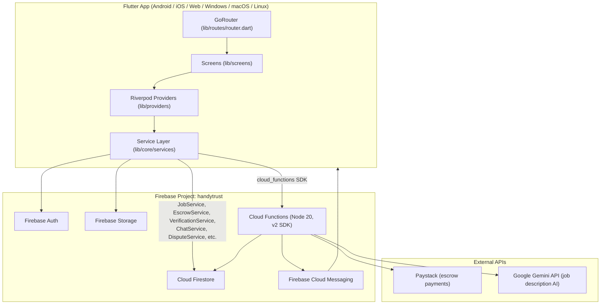

# HandyTrust

Nigeria's trusted service marketplace — a Flutter application connecting customers with verified, vetted artisans, with Firebase-backed escrow payments, identity verification, real-time chat, disputes, and trust scoring.

## Table of Contents

- [Overview](#overview)
- [System Architecture](#system-architecture)
- [Tech Stack](#tech-stack)
- [Firebase Services Used](#firebase-services-used)
- [Cloud Functions](#cloud-functions)
- [Data Model](#data-model)
- [Folder Structure](#folder-structure)
- [Setup Instructions](#setup-instructions)
- [Known Limitations](#known-limitations)

## Overview

HandyTrust supports three roles on a single account model:

- **Customer** — posts job requests, receives quotes, chats with artisans, pays into escrow, reviews completed work.
- **Artisan** — submits identity verification (selfie + government ID), browses/quotes open jobs, manages a portfolio, completes jobs, receives payouts.
- **Admin** — reviews artisan verification submissions, approves/rejects artisan profiles, resolves disputes, monitors jobs/support tickets.

A user's `roles` array (`lib/models/user_model.dart`) can contain `customer`, `artisan`, and/or `admin`; `activeRole` determines which UI is shown. The admin role has no self-service signup path — it must be granted manually (see [Known Limitations](#known-limitations)).

## System Architecture



### Service-layer write discipline

All mutations to `/jobs` go through a single class, `JobService` (`lib/core/services/job_service.dart`):

- Every write runs inside a Firestore transaction — no bare `.update()` calls.
- State transitions are validated against an explicit `allowedTransitions` map (see [Data Model](#data-model)) unless an admin override context is supplied.
- Every transaction writes an immutable `auditLogs` subcollection entry atomically with the job mutation (all-or-nothing).
- `lastUpdatedAt`, `lastUpdatedBy`, and `updateVersion` are stamped on every mutation.
- Milestone timestamps use `FieldValue.serverTimestamp()` — client clocks are never trusted.

Other domains follow the same single-writer pattern: `VerificationService` for `/verifications`, `EscrowService`/`DemoEscrowService` for escrow state (routed through `JobService`), `DisputeService` for `/disputes`, `QuoteService` for `/jobs/{id}/quotes`, `ChatService` for `/jobs/{id}/messages`, and `StorageService` as the single upload/delete entry point for Firebase Storage.

### Job lifecycle (state machine)

```
requested → matched → inChat → paymentPending → escrowLocked → inProgress → submitted → completed
                                                      ↓               ↓
                                                  disputed ────────────┘
                                                      ↓
                                                  resolved

Cancellable from: requested, matched, inChat
```

(`JobStatus` enum, `lib/models/job_model.dart`; transitions enforced identically in `JobService.allowedTransitions` and in `firestore.rules`' `_isValidJobTransition`.)

## Tech Stack

| Layer | Technology |
|---|---|
| App framework | Flutter (Dart SDK `^3.11.4`), targets Android, iOS, Web, Windows, macOS, Linux |
| State management | `flutter_riverpod` |
| Navigation | `go_router` (auth-aware redirect via `AuthChangeNotifier`) |
| Backend | Firebase (Auth, Firestore, Storage, Messaging, Functions) |
| Cloud Functions runtime | Node.js 20, `firebase-functions` v2 SDK |
| Payments | Paystack (WebView checkout + REST verification) |
| AI | Google Gemini (`gemini-2.0-flash`) via Cloud Functions |
| Networking | `dio` (REST), `cloud_functions` (callables) |
| Local persistence | `flutter_secure_storage`, `shared_preferences` |
| Media | `image_picker`, `flutter_image_compress`, `cached_network_image` |
| Location | `geolocator`, `geocoding` |
| Notifications | `firebase_messaging` + `flutter_local_notifications` |

## Firebase Services Used

| Service | Purpose |
|---|---|
| **Firebase Auth** | Email/password and phone sign-in (`lib/firebase/auth`, `lib/core/auth`). Anonymous sign-in is explicitly excluded from privileged operations — both `firestore.rules` and `storage.rules` reject `request.auth.token.firebase.sign_in_provider == 'anonymous'`. |
| **Cloud Firestore** | Primary database — jobs, users, artisans, verifications, disputes, payments, reviews, quotes, notifications, support tickets, audit logs. Security rules in `firestore.rules`. |
| **Firebase Storage** | Job photos, profile photos, verification documents (selfie/ID), artisan portfolio images, dispute evidence. Security rules in `storage.rules`, all uploads centralized in `StorageService`. |
| **Firebase Cloud Messaging (FCM)** | Push notifications for job status changes, quotes, disputes, verification outcomes. Tokens stored in `/fcm_tokens/{uid}` (admin-SDK-read-only). Paired with `flutter_local_notifications` for in-app/background display. |
| **Cloud Functions (2nd gen)** | Server-side logic — see [Cloud Functions](#cloud-functions) below. |

Firebase project ID: `handytrust` (see `firebase.json` / `lib/firebase_options.dart`).

## Cloud Functions

Defined in `functions/index.js` (Node 20, `firebase-functions` v2):

| Function | Trigger | Purpose |
|---|---|---|
| `paystackWebhook` | HTTPS (`onRequest`) | Verifies Paystack HMAC-SHA512 signature using `PAYSTACK_SECRET_KEY` secret, locks escrow on successful payment. |
| `autoReleaseEscrow` | Scheduled (`onSchedule`, every 1 hour) | Auto-releases escrow after 48 hours of customer inaction. |
| `onJobCompleted` | Firestore (`onDocumentUpdated`, `jobs/{jobId}`) | Updates artisan stats (completed jobs, ratings aggregation) on completion. |
| `onArtisanRatingChanged` | Firestore (`onDocumentUpdated`, `artisans/{artisanId}`) | Recomputes the artisan's weighted trust score. |
| `onArtisanVerificationChanged` | Firestore (`onDocumentUpdated`, `artisans/{artisanId}`) | Recomputes trust score when `verificationStatus` changes (verification accounts for 15% of the trust score: `unverified`=0, `id_submitted`=50, `id_verified`/`trusted`=100). |
| `onDisputeCreated` | Firestore (`onDocumentCreated`, `disputes/{disputeId}`) | Sends an admin alert on new disputes. |
| `verifyPayment` | Callable (`onCall`) | Verifies a Paystack transaction reference server-side. |
| `analyzeJob` | Callable (`onCall`) | Sends a job description (+ up to 3 base64 images) to Gemini, returns a suggested category, confidence score, and an enhanced description. |

Required secrets (Firebase Functions secret manager): `PAYSTACK_SECRET_KEY`, `GEMINI_API_KEY`.

## Data Model

Top-level Firestore collections (from `firestore.rules`):

- `users/{uid}` — profile, roles, account status.
- `artisans/{uid}` — public artisan profile (category, rating, trust score, `approvalStatus`, `verificationStatus`). Public read requires `approvalStatus == 'approved'` **and** `verificationStatus in ['id_verified', 'trusted']`.
- `artisan_private/{uid}` — bank details, private ID data (owner/admin only).
- `jobs/{jobId}` — the job lifecycle document.
  - `jobs/{jobId}/auditLogs/{logId}` — immutable, server-written only.
  - `jobs/{jobId}/messages/{msgId}` — per-job chat.
  - `jobs/{jobId}/quotes/{quoteId}` — document ID == artisan ID (structurally enforces one active quote per artisan per job).
- `payments/{paymentId}` — payment/escrow records.
- `reviews/{reviewId}` — customer reviews, only on completed jobs.
- `disputes/{disputeId}` — dispute records with artisan response fields.
- `verifications/{uid}` — selfie/government-ID submissions for admin review.
- `portfolio_analytics/{artisanId}` — monotonic view-count analytics.
- `fcm_tokens/{uid}` — push tokens, unreadable by clients.
- `escrow_releases/{id}` — escrow release queue processed by Cloud Functions.
- `admins/{uid}` — admin registry (existence of this doc grants Firestore-level admin access via `isAdmin()`).
- `config/{doc}` — client-readable config (e.g. Paystack public key, feature flags), write-only via console/Admin SDK.
- `support_tickets/{ticketId}` — customer/artisan support requests.
- `notifications/{notifId}` — primarily admin/Cloud-Function-written; narrowly extended to let job parties notify each other on a whitelisted set of quote/dispute/review event types.

Firebase Storage paths (from `storage.rules`):

- `jobs/{jobId}/{uid}/*` — job photos (5 MB limit, image content-type enforced).
- `users/{uid}/*` — profile photos (5 MB limit, image content-type enforced).
- `artisan_portfolio/{uid}/*` — portfolio photos (5 MB limit, image content-type enforced).
- `verifications/{uid}/*` — selfie + government ID (10 MB limit, **no content-type restriction**).
- `disputes/{disputeId}/{uid}/*` — dispute evidence (5 MB limit, image content-type enforced).

## Folder Structure

```
lib/
├── core/
│   ├── auth/            # secure token storage, auth providers
│   ├── constants/       # service category definitions
│   ├── errors/          # typed job exceptions
│   ├── firebase/        # Firebase bootstrap (firebase_initializer.dart)
│   ├── network/         # Dio client, auth interceptor
│   ├── services/        # single-writer service layer (JobService, EscrowService,
│   │                       VerificationService, StorageService, ChatService,
│   │                       DisputeService, QuoteService, MatchingService,
│   │                       NotificationService, PaymentService, PaystackService,
│   │                       PortfolioService, SupportTicketService, AuthService)
│   └── utils/           # safe Firestore stream/parse helpers
├── firebase/
│   ├── auth/             # FirebaseAuthService, AuthRepository
│   ├── firestore/        # FirestoreRepository, collection name constants
│   └── messaging/        # LocalNotificationService, icon service
├── models/               # plain Dart models (JobModel, UserModel, QuoteModel, ...)
├── providers/            # Riverpod providers binding services to UI
├── routes/               # router.dart — GoRouter config + auth redirect
├── screens/
│   ├── admin/            # admin dashboard (verification review, jobs, disputes, tickets)
│   ├── artisan/          # artisan dashboard, registration, portfolio, bank details
│   ├── auth/             # login, registration, splash, suspended/verify-email screens
│   ├── chat/             # job chat screen
│   ├── dispute/          # dispute filing/response screen
│   ├── home/             # home, service request, open jobs feed
│   ├── job/              # job detail, completion
│   ├── notifications/    # notifications screen
│   ├── payment/          # payment screen, Paystack WebView, demo escrow
│   ├── review/           # review screen
│   ├── settings/         # settings screen
│   ├── support/          # contact support screen
│   └── verification/     # artisan identity verification upload screen
├── theme/                # app_colors.dart, app_theme.dart
├── widgets/              # shared widgets (job timeline, star rating, notification bell, ...)
└── main.dart             # app bootstrap, Firebase init, MaterialApp.router

functions/
└── index.js              # all Cloud Functions (see above)

firestore.rules           # Firestore security rules
firestore.indexes.json    # composite index definitions
storage.rules             # Storage security rules
firebase.json             # Firebase project/emulator config
```

## Setup Instructions

### Prerequisites

- Flutter SDK compatible with Dart `^3.11.4`
- A Firebase project (or access to the existing `handytrust` project)
- Firebase CLI (`npm install -g firebase-tools`) and FlutterFire CLI for regenerating `firebase_options.dart` if targeting a new project
- Node.js 20 (for Cloud Functions)

### 1. Install Flutter dependencies

```bash
flutter pub get
```

### 2. Firebase configuration

This repo already includes `lib/firebase_options.dart` / `lib/core/firebase/firebase_options.dart` and `firebase.json` wired to the `handytrust` project, plus `android/app/google-services.json` output path. To point at your own Firebase project instead:

```bash
firebase login
flutterfire configure
```

### 3. Cloud Functions

```bash
cd functions
npm install
```

Set the required secrets before deploying:

```bash
firebase functions:secrets:set PAYSTACK_SECRET_KEY
firebase functions:secrets:set GEMINI_API_KEY
```

Deploy functions, rules, and indexes:

```bash
firebase deploy --only functions,firestore:rules,firestore:indexes,storage:rules
```

### 4. Run the app

```bash
flutter run
```

Or target a specific platform, e.g.:

```bash
flutter run -d chrome
flutter run -d windows
```

### 5. Admin access

There is no in-app admin signup flow. To grant admin access:

1. Create a document at `/admins/{uid}` in Firestore (grants Firestore-level admin per `firestore.rules`' `isAdmin()`).
2. Separately set a custom auth claim `{ admin: true }` on the same user (required by `storage.rules`' `isAdmin()`, which checks `request.auth.token.admin` rather than the `/admins` collection).
3. Add `'admin'` to that user's `roles` array in `/users/{uid}` so the app's `UserModel.isAdmin` resolves correctly and routes to the admin dashboard.

## Known Limitations

- **Two separate admin-authority mechanisms.** Firestore rules grant admin via the existence of an `/admins/{uid}` document; Storage rules grant admin via a `request.auth.token.admin` custom claim. Both must be set up for an account to have full admin capability (see [Setup Instructions](#5-admin-access)) — there is no single source of truth or automated sync between the two.
- **No automated test suite.** `flutter_test` is a declared dev dependency, but no `test/` directory with actual tests exists in this repository.
- **No CI/CD pipeline.** No `.github/workflows` or other CI configuration is present; testing and deployment are manual.
- **Demo escrow path exists alongside the live Paystack flow.** `DemoEscrowService` simulates the `paymentPending → escrowLocked` transition (routed through `JobService` for audit-trail consistency) without a real payment — useful for development/demos, but it is reachable from the app's payment screens and is not gated behind a build flag.
- **Payments are Nigeria/Paystack-specific.** Currency formatting throughout the app is hardcoded to NGN (₦); there is no multi-currency or alternate payment-provider support.
- **Verification documents have no content-type restriction.** `storage.rules`' `/verifications/{uid}/*` path enforces a 10 MB size cap but, unlike every other upload path in the app, does not restrict `contentType` to `image/.*` — a non-image file under 10 MB can be uploaded as a "selfie" or "ID".
- **`flutter analyze` baseline has 6 pre-existing issues** (deprecated `TextFormField.value`/`desiredAccuracy` usages, an unnecessary import, an unnecessary non-null assertion, unnecessary underscores) that have not been cleaned up.
- **AI job analysis (`analyzeJob`) only operates on description text and inline base64 images** at job-creation time, before any image has been uploaded to Storage — it cannot analyze previously stored job photos.
- **Cross-platform build artifacts present but unverified here.** `android/`, `ios/`, `web/`, `windows/`, `macos/`, and `linux/` platform folders all exist, but this audit did not build or run on every platform — platform-specific configuration (signing, entitlements, web Firebase config) should be verified independently per target.
